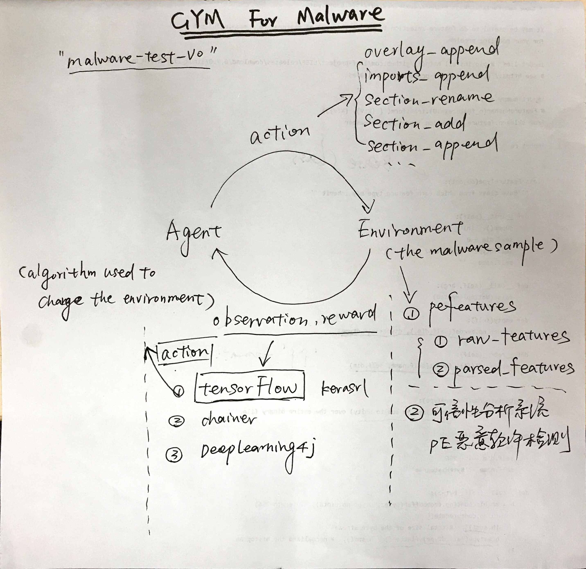
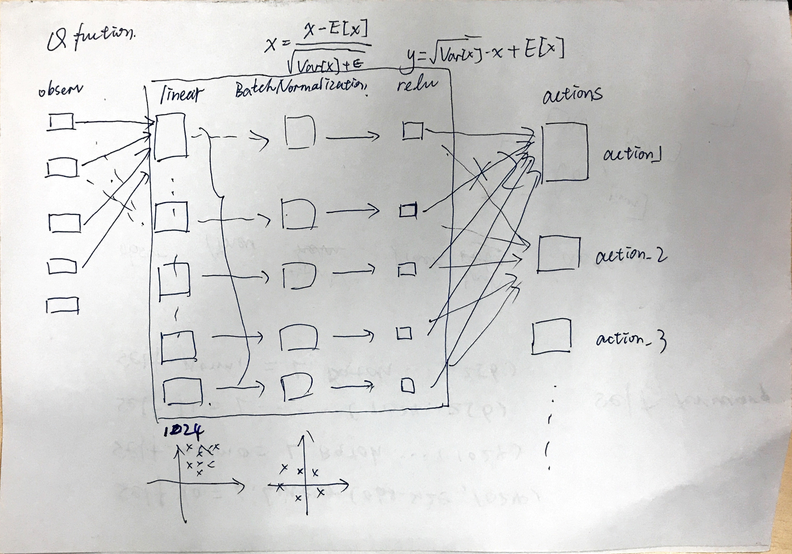

# 使用深度强化学习进行恶意软件检测规避

The goal of this project is to improve the author's [original work](https://github.com/endgameinc/gym-malware).  
In his Paper: **Evading Machine Learning Malware Detection**, He builds a framework for attacking static PE anti-malware engines based on reinforcement learning.

The framework of the project is as follows:

## Basics
There are two basic concepts in reinforcement learning: 
* the environment (in our case, the malware sample) 
* the agent (the algorithm used to change the environment).  

The agent sends `actions` to the environment, and the environment replies with `observations` and `rewards`.

DQN Q-function:
 
## Gym-Malware Environment
Reinforcement agent against the malware environment consisting of the following components:

* Action Space
* Independent Malware Classifier
* OpenAI framework malware environment, modification on the basis of the original system `Gym-Malware`
 
### Action Space

The moves or actions that can be performed on a malware sample in our environment consist of the following binary manipulations:
* **ARBE**. Append random bytes to the end of PE file
* **ARI**. Append a random name library with random function name to the import address table of PE file
* **ARS**. Append a random name section to the section table of PE file
* **RS**. Remove signature from certificate table

The agent will randomly select these four actions in an attempt to bypass the below independent classifier. Over time, the agent learns which combinations lead to the highest rewards, or learns a policy (*like an optimal plan of attack for any given observation*).

### Independent Classifier

Included as a default model is a [gradient boosted decision trees model] trained on 50k malicious and 50k benign samples with the following features extracted:
* Byte-level data (e.g. histogram and entropy)
* Header
* Section
* Import/Exports

[gradient boosted decision trees model]: http://scikit-learn.org/stable/modules/generated/sklearn.ensemble.GradientBoostingClassifier.html

### OpenAI framework malware environment
We had redefined the environment based on the `gym-malware` previous work. ^_^

## TODO
1. Action修改：
  * 按照分类器重新设计action
  * 尽量去掉action随机性
1. 修改dqn模型，Prioritize Experience Replay?
